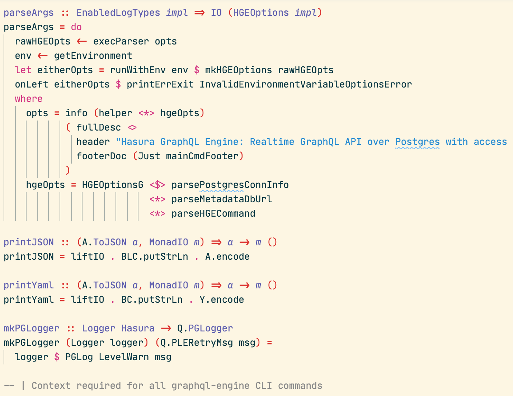

# Hackage Theme

Theme for VSCode that matches the source code styling used by [hackage](https://hackage.haskell.org/), the Haskell package repository.  An example of that styling can be found [here](https://hackage.haskell.org/package/graphql-0.11.1.0/docs/src/Language.GraphQL.html#graphql).

## Installation

https://marketplace.visualstudio.com/items?itemName=dmarticus.hackage-theme

Install using Command Palette
Go to View -> Command Palette or press Cmd+Shift+P (Ctrl+Shift+P on Windows)
Then enter Install Extension
Write hackage-theme
Select it or press Enter to install

## Screenshot

